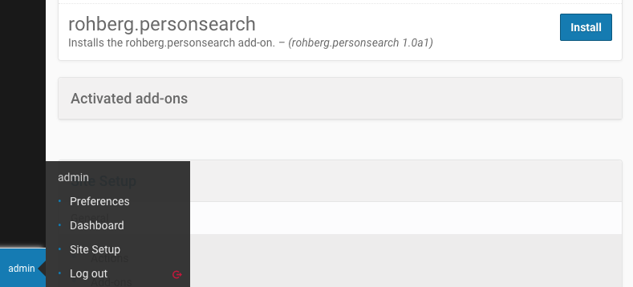
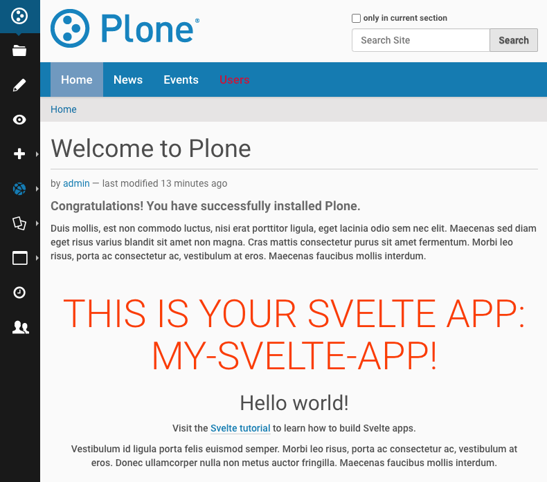
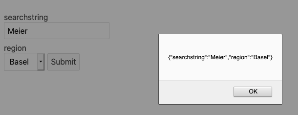

# Interactive Components in Classic Plone with Svelte

**Talk Plone Conference 2020  
Katja Süss**

[https://interactive-components-in-classic-plone.readthedocs.io](https://interactive-components-in-classic-plone.readthedocs.io)

Maik Derstappen created a handy bob template that creates a Plone package with all essential elements for a Svelte app integrated in Plone.
plonecli create addon rohberg.personsearch

    cd roberg.personsearch
    plonecli add svelte_app

    cd svelte_src/my_svelte_app 
    npm install
    npm run dev

Your Svelte app opens in browser http://localhost:10001/

Open your package in editor and change the file ‘App.svelte’. Add a `<h2>Hello world!</h2>`
and see the change reflected in browser.

Change svelte_src/my-svelte-app/src/main.js:

    let targets = document.getElementsByClassName("my-svelte-app");

Change src/rohberg/personsearch/svelte_apps/my-svelte-app/index.html: 

    <div class="my-svelte-app"></div>

We will now see how this Svelte app is integrated in Plone.

Open another terminal window, go to the package folder and build your Plone.

    cd ../..  
    plonecli build 

run the newly created Zope instance

    ./bin/instance fg



Create Plone instance and install the Plone package on “Site Setup”.

Integrate your Svelte app in home page by pasting in TinyMCE

    <div class="my-svelte-app"></div> 



The integration is done.

## Person Search

- search form
- fetch membrane data 
- display fetched membrane users data

We start with a search form.
Note: If you use VSCode, install `svelte.svelte-vscode` to help you with the code.

For a simple form with search field and selection of the region paste the following code in your ‘App.svelte’

TODO just form

You see a simple form that even has an event handler.



We can use the values to fetch the according data of matching membrane users.
But first let’s create some dummy cards.

Add component SearchResults to your App.svelte.

  <SearchResults />

We define it in SearchResults.svelte

TODO cards


We need some experts with information about their competence, region and organization.

Let’s add the Membrane dependency to our Plone package.

    install_requires=[
        'setuptools',
        # -*- Extra requirements: -*-
        'z3c.jbot',
        'plone.api>=1.8.4',
        'plone.restapi',
        'plone.app.dexterity',
        'Products.membrane>= 5.0.0a1',
        'dexterity.membrane>=3.0.0a1',
    ],

We create a behavior 'expert' to add the fields competence, region and organization.

TODO behavior 'expert'

Let’s now show some search results.


## Fetching the data from Plone via RestAPI

We want to distinguish between Svelte standalone and in Plone:

    npm install @rollup/plugin-replace --save-dev

`rollup.config.js`:

    import replace from '@rollup/plugin-replace';

    const production = !process.env.ROLLUP_WATCH;

    export default {
      plugins: [
        replace({
          // two level deep object should be stringified
          process: JSON.stringify({
            env: {
              isProd: production,
            }
          }),
        }),
      ],
    };

Now we can define the API URL to be `/` for production (integration in Plone) and `localhost:8080/Plone/` for developing with a standalone Svelte app.

So we have

    let apiURL = process.env.isProd ? '/' : 'http://localhost:8080/Plone/';
    apiURL = apiURL + '@search?portal_type=dexterity.membrane.member&fullobjects=1'
    let experts = [];

and will fetch the data of experts on mount.

We define an asynchronous function that gets called on mount.

``` svelte hl_lines="26-30"
import { onMount } from "svelte";

snip

function getExperts() {
  const response = fetch(apiURL, {
    method: "GET",
    headers: {
      "Content-Type": "application/json",
      "Accept": "application/json"
    }
  })
  .then(response => {
    if (!response.ok) {
      throw new Error('Network response was not ok');
    }
    return response.json();
  })
  .then(data => {
    experts = data.items;
  })
  .catch(error => {
    console.error('There has been a problem with your fetch operation:', error);
  });
};

onMount(
  async () => {
    await getExperts();
  }
);
```

The fetch is addressing the REST API of Plone, its sending a GET request with json data. 
We save the expert data to variable experts and catch errors like network errors.


**Note**

The Fetch API provides a JavaScript interface for accessing and manipulating parts of the HTTP pipeline, such as requests and responses. It also provides a global fetch() method that provides an easy, logical way to fetch resources asynchronously across the network.

[https://developer.mozilla.org/en-US/docs/Web/API/Fetch_API/Using_Fetch](https://developer.mozilla.org/en-US/docs/Web/API/Fetch_API/Using_Fetch)

To have some information about the network stuff, we add an else section to the each section.

``` svelte hl_lines="11-13"
{#each experts as expert, i}
  <div class="card">
    <span class="fullname">{expert.first_name} {expert.last_name}</span>
    <br>
    <span class="region">{expert.competence}</span>
    <br>
    <span class="region">{expert.organisation}</span>
    <br>
    <span class="region">{expert.region}</span>
  </div>
{:else}
  <!-- this block renders when experts.length === 0 -->
  <p>loading...</p>
{/each}
```

You see a network error in console. Why is this? Please go to your Plone configuration panel and install `plone.restapi`.

To solve the CORS situation we modify the buildout. See [https://github.com/plone/plone.rest#cors](https://github.com/plone/plone.rest#cors) for more information

`buildout.cfg`:

    [instance]
    zcml-additional =
      <configure xmlns="http://namespaces.zope.org/zope"
                xmlns:plone="http://namespaces.plone.org/plone">
      <plone:CORSPolicy
        allow_origin="http://localhost:10001,http://127.0.0.1:10001"
        allow_methods="DELETE,GET,OPTIONS,PATCH,POST,PUT"
        allow_credentials="true"
        expose_headers="Content-Length,X-My-Header"
        allow_headers="Accept,Authorization,Content-Type,X-Custom-Header,Origin"
        max_age="3600"
        />
      </configure>

Run buildout.


You see all Persons.  
For **filtering** the search by region or **searching** for name and competence we will define an index for region and make name and competence searchable.

`catalog.xml`

``` xml hl_lines="3-5"
    <?xml version="1.0"?>
    <object name="portal_catalog">
      <index name="region" meta_type="FieldIndex">
        <indexed_attr value="region"/>
      </index>
    </object>
```


## Information about Svelte
* Official Site with tutorial and API info: [https://svelte.dev/](https://svelte.dev/)
* Excellent training: Maximilian Schwarzmüller on Udemy [https://www.udemy.com/course/sveltejs-the-complete-guide/learn/lecture/14689784#overview](https://www.udemy.com/course/sveltejs-the-complete-guide/learn/lecture/14689784#overview)
* Mozilla Svelte tutorials [https://developer.mozilla.org/en-US/docs/Learn/Tools_and_testing/Client-side_JavaScript_frameworks#Svelte_tutorials](https://developer.mozilla.org/en-US/docs/Learn/Tools_and_testing/Client-side_JavaScript_frameworks#Svelte_tutorials)
