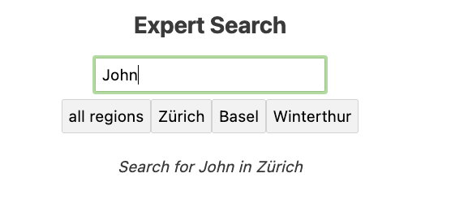

# Interactive Components in Classic Plone

**Svelte in Plone**

See this talk at https://interactive-components-in-classic-plone.readthedocs.io

Maik Derstappen created a handy bob template that creates a Plone package with all essential elements for a Svelte app integrated in Plone.
plonecli create addon rohberg.personsearch

    cd roberg.personsearch
    plonecli add svelte_app

    cd svelte_src/my_svelte_app 
    npm install
    npm run dev

Your Svelte app opens in browser http://localhost:10001/

Open your package in editor and change the file ‘App.svelte’. Add a `<h2>Hello world!</h2>`
and see the change reflected in browser.

Change svelte_src/my-svelte-app/src/main.js:

    let targets = document.getElementsByClassName("my-svelte-app");

Change src/rohberg/personsearch/svelte_apps/my-svelte-app/index.html: 

    

We will now see how this Svelte app is integrated in Plone.

Open another terminal window, go to the package folder and build your Plone.

    cd ../..  
    plonecli build 

run the newly created Zope instance

    ./bin/instance fg

Create Plone instance and install the Plone package on “Site Setup”.

Integrate your Svelte app in home page by pasting in TinyMCE

    

 

The integration is done.

## Person Search

- search form
- fetch membrane data 
- display fetched membrane users data

We start with a search form.
Note: I you use VSCode, install `svelte.svelte-vscode` to help you with the code.

We use the form library svelte-forms-lib
Install with 
npm i svelte-forms-lib

Import the lib in your .svelte file
import { createForm } from "svelte-forms-lib";
See https://svelte-forms-lib-sapper-docs.now.sh/basic for more information about the form library,

For a simple form with search field and selection of the region paste the following code in your ‘App.svelte’

    

    

    <!--<svelte:options tag="my-svelte-app" /> -->

    <main>
        <h2>Person Search</h2>

        <form action="">
          <input class="searchstring" bind:value={searchstring} placeholder="search">
           
          {#each menuregions as region}
            <input 
              type=button 
              class="regionbutton" 
              on:click|preventDefault={handleClick} 
              value={region}>
          {/each}
        </form>
        
<i>Search{#if searchstring}{' '}for {searchstring}{/if} in {region}</i>

    </main>

You see a simple form that even has an event handler.

We can use the values to fetch the according data of matching membrane users.
But first let’s create some dummy cards.

Add component SearchResults to your App.svelte.

  <SearchResults />

We define it in SearchResults.svelte

TODO cards

We need some experts with information about their competence, region and organization.

Let’s add the Membrane dependency to our Plone package.

    install_requires=[
        'setuptools',
        # -*- Extra requirements: -*-
        'z3c.jbot',
        'plone.api>=1.8.4',
        'plone.restapi',
        'plone.app.dexterity',
        'Products.membrane>= 5.0.0a1',
        'dexterity.membrane>=3.0.0a1',
    ],

We create a behavior 'expert' to add the fields competence, region and organization.

TODO behavior 'expert'

Let’s now show some search results.

## Fetching the data from Plone via RestAPI

We want to distinguish between Svelte standalone and in Plone:

    npm install @rollup/plugin-replace --save-dev

`rollup.config.js`:

    import replace from '@rollup/plugin-replace';

    const production = !process.env.ROLLUP_WATCH;

    export default {
      plugins: [
        replace({
          // two level deep object should be stringified
          process: JSON.stringify({
            env: {
              isProd: production,
            }
          }),
        }),
      ],
    };

Now we can define the API URL to be /api/ for production (integration in Plone) and 'localhost:8080/api/' for developing with a standalone Svelte app.

So we have

    let apiURL = process.env.isProd ? '/api' : 'localhost:8080/api/';
    let expert = [];

and will fetch the data of experts on mount.

We define an asynchron function that gets called on mount.

    import { onMount } from "svelte";

To have some information about the network stuff, we wrap TODO

    {#await promise}
      
...waiting

    {:then}
TODO

You see a network error. Why is this? Please go to your Plone configuration panel and install plone.restapi.

set API url to TODO

TODO CORS
https://github.com/plone/plone.rest#cors

`buildout.cfg`:

    [instance]
    zcml-additional =
      <configure xmlns="http://namespaces.zope.org/zope"
                xmlns:plone="http://namespaces.plone.org/plone">
      <plone:CORSPolicy
        allow_origin="http://localhost:10001,http://127.0.0.1:10001"
        allow_methods="DELETE,GET,OPTIONS,PATCH,POST,PUT"
        allow_credentials="true"
        expose_headers="Content-Length,X-My-Header"
        allow_headers="Accept,Authorization,Content-Type,X-Custom-Header,Origin"
        max_age="3600"
        />
      </configure>

You see all Persons. For filtering the search by region or searching for name and competence we will define an index for region and make name and competence searchable.

## Information about Svelte
* Official Site with tutorial and API info: [https://svelte.dev/](https://svelte.dev/)
* Excellent training: Maximilian Schwarzmüller on Udemy [https://www.udemy.com/course/sveltejs-the-complete-guide/learn/lecture/14689784#overview](https://www.udemy.com/course/sveltejs-the-complete-guide/learn/lecture/14689784#overview)
* Mozilla Svelte tutorials [https://developer.mozilla.org/en-US/docs/Learn/Tools_and_testing/Client-side_JavaScript_frameworks#Svelte_tutorials](https://developer.mozilla.org/en-US/docs/Learn/Tools_and_testing/Client-side_JavaScript_frameworks#Svelte_tutorials)
