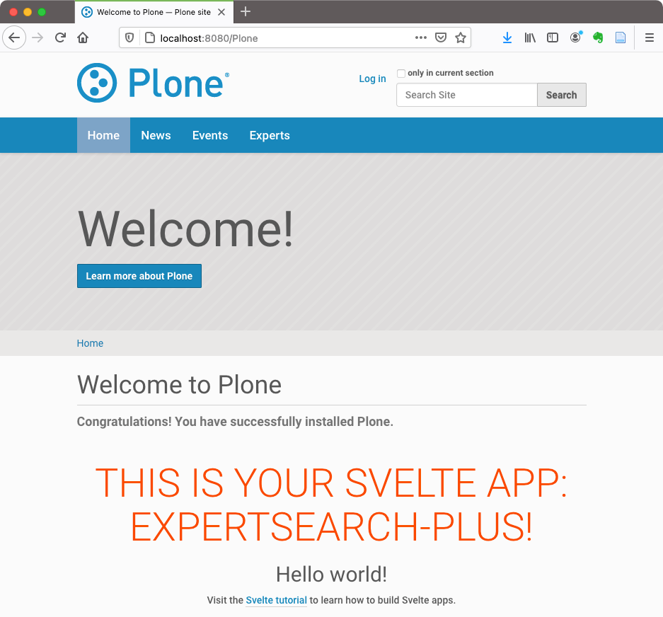

# Interactive Components in Classic Plone

Svelte in Plone

Evernote “bobtemplates / plonecli and svelte”
https://www.evernote.com/shard/s114/nl/12505810/bb051940-6c32-4957-bf09-170a7e6cf808/

Cras justo odio, dapibus ac facilisis in, egestas eget quam. Cum sociis natoque penatibus et magnis dis parturient montes, nascetur ridiculus mus. Cum sociis natoque penatibus et magnis dis parturient montes, nascetur ridiculus mus. Lorem ipsum dolor sit amet, consectetur adipiscing elit. Cras justo odio, dapibus ac facilisis in, egestas eget quam. Maecenas faucibus mollis interdum. Nullam id dolor id nibh ultricies vehicula ut id elit.

Maik Derstappen created a handy bob template that creates a Plone package with all essential elements for a Svelte app integrated in Plone.
plonecli create addon rohberg.personsearch

    cd roberg.personsearch
    plonecli add svelte_app

    cd svelte_src/my_svelte_app 
    npm install
    npm run dev

Your Svelte app opens in browser http://localhost:10001/

Open your package in editor and change the file ‘App.svelte’. Add a `<h2>Hello world!</h2>`
and see the change reflected in browser.

Change svelte_src/my-svelte-app/src/main.js:

    let targets = document.getElementsByClassName("my-svelte-app");

Change src/rohberg/personsearch/svelte_apps/my-svelte-app/index.html: 

    

We will now see how this Svelte app is integrated in Plone.

Open another terminal window, go to the package folder and build your Plone.

    cd ../..  
    plonecli build 

run the newly created Zope instance

    ./bin/instance fg

Create Plone instance and install the Plone package on “Site Setup”.

Integrate your Svelte app in home page by pasting in TinyMCE

    

 

The integration is done.

## Person Search

- search form
- fetch membrane data 
- display fetched membrane users data

We start with a search form.
Note: I you use VSCode, install `svelte.svelte-vscode` to help you with the code.

We use the form library svelte-forms-lib
Install with 
npm i svelte-forms-lib

Import the lib in your .svelte file
import { createForm } from "svelte-forms-lib";
See https://svelte-forms-lib-sapper-docs.now.sh/basic for more information about the form library,

For a simple form with search field and selection of the region paste the following code in your ‘App.svelte’

    

    

    <!--<svelte:options tag="my-svelte-app" /> -->

    <main>
      <h2>Person Search</h2>

      <form on:submit={handleSubmit}>

        <label for="searchstring">searchstring</label>
        <input
          id="searchstring"
          name="searchstring"
          on:change={handleChange}
          bind:value={$form.searchstring}
        />

        <label for="region">region</label>
        <select
          id="region"
          name="region"
          on:change={handleChange}
          bind:value={$form.region}>
          <option></option>
          <option>Zurich</option>
          <option>Basel</option>
          <option>Bern</option>
        </select>
        <button type="submit">Submit</button>
      </form>
    </main>

You see a simple form that even has an event handler.

We can use the values to fetch the according data of matching membrane users.
But first let’s create some dummy cards.

Let’s add the Membrane dependency to our Plone package.

    install_requires=[
        'setuptools',
        # -*- Extra requirements: -*-
        'z3c.jbot',
        'plone.api>=1.8.4',
        'plone.restapi',
        'plone.app.dexterity',
        'Products.membrane>= 5.0.0a1',
        'dexterity.membrane>=3.0.0a1',
    ],

Let’s now show some search results

TODO cards.
Add component SearchResults to your App.svelte.

  <SearchResults />

We define it in SearchResults.svelte

Information about Svelte
Official Site with tutorial and API info: https://svelte.dev/
Excellent training: Maximilian Schwarzmüller on Udemy https://www.udemy.com/course/sveltejs-the-complete-guide/learn/lecture/14689784#overview
Mozilla Svelte tutorials https://developer.mozilla.org/en-US/docs/Learn/Tools_and_testing/Client-side_JavaScript_frameworks#Svelte_tutorials